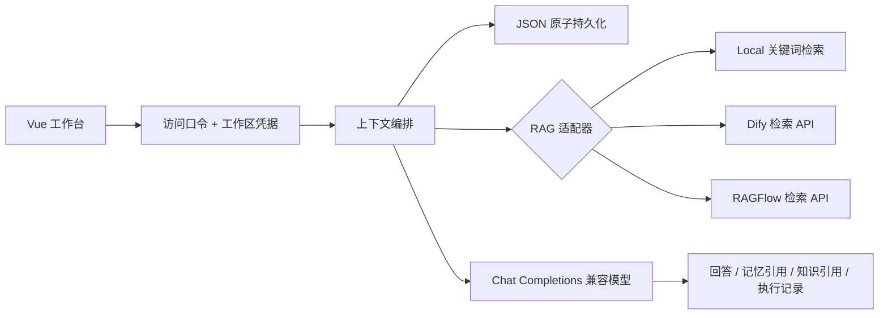

# Recall Agent

**记得你，再向前。** BStronger1 的个人 AI 产品集：以可控长期记忆和可切换知识检索为核心的个人智能体。

[在线交互演示](https://bstronger1.github.io/recall-agent/) · [部署说明](docs/DEPLOYMENT.md)


> 当前为 0.1 工程预览。演示模式不调用模型；真实模式需要后端访问口令与模型密钥。Local 是关键词检索，不是向量数据库。Dify / RAGFlow 是已实现的 API 适配器，配置真实服务后需要联调。

## 核心能力

- **可控记忆**：偏好 / 事实 / 项目三类记忆，显式添加、编辑、删除；跨页面与服务重启保留。
- **上下文编排**：最近 20 条会话 + 最多 6 条相关记忆 + 最多 5 个知识片段；前端展示召回内容、来源和执行记录。
- **可切换 RAG**：Local 中英文关键词检索、Dify 知识库、RAGFlow 数据集；配置好连接器后页面一键切换，也可关闭检索。
- **个人工作区**：浏览器生成 256 位随机工作区凭据，服务端按工作区隔离存储；统一访问口令保护 API。
- **自带模型 API**：设置页选择服务商、填写接口地址/模型名/密钥；支持真实连接测试、保存、更换和删除。个人配置优先于站点默认模型。
- **可部署交付**：前后端同源 Docker 镜像、持久卷、Render Blueprint、自动构建测试。

这是一条确定性的记忆→检索→生成工作流；当前版本不执行 shell，不自动写入用户记忆，不声称具备任意工具的自主规划能力。

## 运行

推荐 Java 21、Node 22 和 Maven 3.9。默认后端是 **recall-server**；根目录旧 `pom.xml` 和 `src` 是历史教学模块，不属于新版运行链路。

```bash
# 终端一：先通过环境变量配置 RECALL_ACCESS_TOKEN 和 MODEL_API_KEY
mvn -f recall-server/pom.xml spring-boot:run
# 终端二
cd yu-ai-agent-frontend
npm ci
npm run dev
```

打开 `http://localhost:3000`。设置页填 **访问口令**（不是模型 API 密钥）后连接。默认页面是明确标注的演示空间，示例记忆不代表用户真实背景，演示编辑只在本次页面内生效。

连接后，在「设置 → 我的模型」填写自己的 API 地址、模型名和 API 密钥，先测试连接，再保存。测试会发送一条简短的真实请求，可能产生少量费用，不会自动保存。已保存密钥不回显；只改模型名时可以留空保留密钥，更换 API 地址必须重新填写。删除个人配置后恢复站点默认模型；未配置默认密钥时需重新填写个人配置才能对话。

支持 Chat Completions 兼容接口，预设 DMXAPI、OpenAI、DeepSeek、阿里云百炼；其他兼容接口须在站点允许域名内。个人密钥按工作区使用 AES-GCM 加密保存在后端，不写入浏览器存储或工作区导出。部署备份须包含整个数据目录（含 `.model-encryption-key`）；加密不能防止持有服务器权限的管理员读取。填写密钥请使用 HTTPS 或 SSH 加密隧道，校园 HTTP 地址本身不加密传输。

如果本机 Maven 全局设置损坏，可使用项目中的空设置覆盖：

```bash
mvn -gs recall-server/maven-settings.xml -s recall-server/maven-settings.xml -f recall-server/pom.xml verify
```

### Docker

```bash
cp .env.example .env
# 编辑 .env 中的 RECALL_ACCESS_TOKEN 和 MODEL_API_KEY
# 建议访问口令使用随机长字符串

docker compose up --build -d
```

打开 `http://localhost:8080`。记忆写入 Docker 命名卷 `recall-data`。不要通过 `docker compose down -v` 删除需要保留的数据。公网发布应使用 HTTPS 反向代理，或托管平台自带 HTTPS。

## 配置

| 环境变量 | 用途 |
| --- | --- |
| `RECALL_ACCESS_TOKEN` | 必填；保护真实 API。空值时 API 关闭，仅可访问健康检查、配置和页面 |
| `MODEL_API_KEY` | 可选站点默认密钥；用户未配置个人模型时使用，二者都为空时不能生成回答 |
| `MODEL_BASE_URL` | Chat Completions 兼容基础地址；默认百炼兼容地址，以 `/v1` 结尾 |
| `CHAT_MODEL` | 默认 `qwen-plus`，需要与模型服务匹配 |
| `RECALL_ALLOWED_MODEL_HOSTS` | 个人 API 的允许域名，逗号分隔；默认见 `.env.example`。仅支持 HTTPS / 443，管理员可添加可信服务商域名 |
| `RECALL_DATA_DIR` | 默认 `./data`；容器使用 `/app/data` |
| `DIFY_BASE_URL` | 例如 `https://api.dify.ai/v1` |
| `DIFY_API_KEY` / `DIFY_DATASET_ID` | Dify 知识库密钥及 ID |
| `RAGFLOW_BASE_URL` | RAGFlow 服务 origin，不含 `/api/v1` |
| `RAGFLOW_API_KEY` / `RAGFLOW_DATASET_ID` | RAGFlow API 密钥及数据集 ID |

配置 Dify 或 RAGFlow 的三个变量并重启服务后，页面「知识连接」对应选项自动可用。检索失败会明确报错，不静默退回其他知识源。Local 的文本不会同步到外部服务；选择外部 RAG 时，当前问题会发送至对应服务。模型服务会收到本次选中的记忆、知识片段与近期对话。

## 架构



## 验证与边界

```bash
mvn -f recall-server/pom.xml verify
cd yu-ai-agent-frontend && npm ci && npm run build
```

- 自动测试覆盖持久化、工作区隔离、路径输入拒绝、编辑删除、历史窗口、检索排序、两类外部 RAG 响应解析、访问控制、错误处理、上下文编排，以及个人模型密钥加密、隔离、接口限制和连接测试不保存配置。
- 外部模型与 RAG 使用模拟响应测试；没有配置真实密钥之前，不能视为第三方服务端到端验收。
- 设计为**单实例个人产品**，文件存储不适用于多副本。需扩展时迁移数据库与账户系统。
- 当前工作区凭据位于浏览器本地；清理浏览器数据或换浏览器会进入新工作区。导出 JSON 是数据备份，当前没有导入/恢复 UI。
- 访问口令是站点级邀请码，不是完整用户账户体系。每类最多 100 条内容、每条最多 16,000 字符；同站最多 2 个生成任务、每分钟最多 20 次模型请求。实例重启会重置限流计数；需在模型平台另设费用上限。
- 关闭长期记忆只停止下一轮显式召回。已写入历史回答的内容仍可能被近期对话带入；彻底移除时同时删除记忆并清空会话。
- 模型可能引用不准确，请通过上下文透镜核对；不把来源面板等同于自动事实核查。
- 云端部署与 GitHub 展示见 [部署说明](docs/DEPLOYMENT.md)。

## 项目来源

新版品牌、记忆工作区、RAG 适配、访问控制和部署链路在此仓库迭代。仓库起点为 [yu-ai-agent](https://github.com/liyupi/yu-ai-agent)，历史代码和来源说明保留在 Git 历史及 [上游说明](docs/UPSTREAM-README.md)。页面不包含原项目推广内容。仓库未对第三方原代码重新声明所有权或另行授予许可证。
