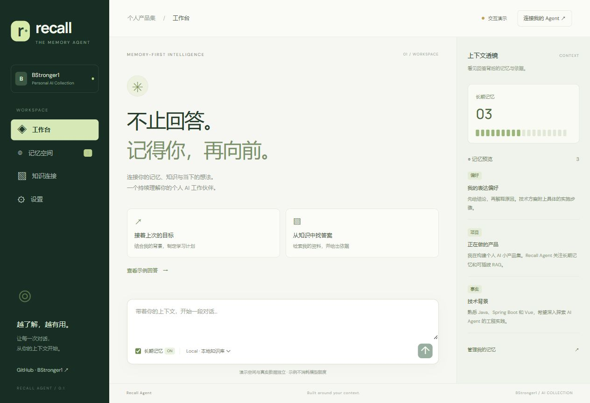
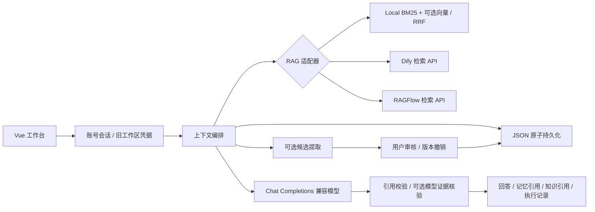

# Recall Agent

**记得你，再向前。** BStronger1 的个人 AI 产品集：以可控长期记忆和可切换知识检索为核心的个人智能体。

[在线交互演示](https://bstronger1.github.io/recall-agent/) · [部署说明](docs/DEPLOYMENT.md)



> 当前为工程预览。演示模式不调用模型；真实模式可自助注册、登录并填写个人模型 API。Local 默认使用 BM25 关键词检索，配置独立 Embedding API 后启用向量混合检索。Dify / RAGFlow 是站点级 API 适配器，目前不开放给自助注册账号。

## 核心能力

- **可控记忆**：偏好 / 事实 / 项目三类记忆，显式添加、编辑、删除；跨页面与服务重启保留。
- **审核式记忆更新**：可选从对话原话提取候选，展示来源和更新前后内容，确认后入库；支持版本撤销，拒绝过期候选覆盖新版本。
- **证据控制**：资料问答在空上下文时澄清；引用编号校验 + 独立模型支持核验。通用对话仅检查引用编号，界面明确显示核验状态。
- **上下文编排**：最近 20 条会话 + 最多 6 条相关记忆 + 最多 5 个知识片段；前端展示召回内容、来源和执行记录。
- **可切换 RAG**：Local 的 BM25 + 可选向量检索通过 RRF 融合；支持 Dify 知识库、RAGFlow 数据集，保留同一套上下文编排。
- **自助账号**：用户名和密码注册登录，无需邀请码；记忆、会话和模型配置绑定账号，跨设备登录访问同一工作区。支持退出登录与旧口令工作区绑定。
- **自带模型 API**：设置页选择服务商、填写接口地址/模型名/密钥；支持真实连接测试、保存、更换和删除。新账号必须使用自己的密钥，不共享站点额度。
- **可部署交付**：前后端同源 Docker 镜像、持久卷、Render Blueprint、自动构建测试。

这是一条确定性的记忆→检索→生成工作流；当前版本不执行 shell，不自动写入用户记忆，不声称具备任意工具的自主规划能力。

## 运行

推荐 Java 21、Node 22 和 Maven 3.9。默认后端是 **recall-server**；根目录旧 `pom.xml` 和 `src` 是历史教学模块，不属于新版运行链路。

```bash
# 终端一：新账号可在页面自行配置模型 API
mvn -f recall-server/pom.xml spring-boot:run
# 终端二
cd yu-ai-agent-frontend
npm ci
npm run dev
```

打开 `http://localhost:3000`。进入「设置 → 创建账号」，设置 3–32 位字母/数字/下划线用户名和至少 12 位密码，然后配置自己的模型 API。用户名不区分大小写。登录最多保留 30 天，同一账号最多保留 10 个设备会话。默认页面是明确标注的演示空间，示例记忆不代表用户真实背景，演示编辑只在本次页面内生效。

登录后，在「设置 → 我的大模型」填写自己的 API 地址、模型名和 API 密钥，先测试连接，再保存。测试会发送一条简短的真实请求，可能产生少量费用，不会自动保存。已保存密钥不回显；只改模型名时可以留空保留密钥，更换 API 地址必须重新填写。删除个人配置后需重新配置才能对话；仅旧口令工作区保留站点默认模型回退。

### 记忆与检索升级

1. 在「设置 → 语义检索」配置支持 `/embeddings` 的独立向量模型。保存前会进行真实接口检查；凭据加密保存在 `data/embeddings/`，不会借用站点默认密钥。默认表单为 DMXAPI 的 `bge-m3`，须确认个人账户权限。
2. 检索使用 BM25（中英文词项、中文二元切分）和向量余弦相似度，RRF 合并两路排名。语义阈值可配置，默认 0.55；阈值不是置信概率，不同模型应分别评测。向量失败会回退 BM25，并显示降级提示。
3. 工作台默认「资料问答」，空资料且无历史时直接澄清；有上下文时生成后再做证据核验。自由聊天、改写当前输入等任务可选「通用对话」。核验使用当前聊天模型的另一次请求，并非独立可信事实源。
4. 在「记忆空间」开启候选提取。每轮最多提出 3 条候选，提取器只处理本轮用户原话及最多 12 条已有记忆摘要；展示原话、旧内容、新内容，用户审核后保存。关闭开关不会自动删除待审核候选，可逐条丢弃。
5. 版本记录保存修改前后内容、来源和时间，最多保留最近 100 条。仅当前版本对应的变更允许撤销；删除记忆会清除关联版本与更新候选。历史会话、已导出文件和部署备份需分别管理。

本实现面向小型工作区：每次最多处理 128 个候选片段，超限会提示；向量缓存最多 512 条，按工作区、模型配置及文本内容隔离，重启后按需重建。它不是专用向量数据库，暂未加入独立 Reranker、自动查询改写、多轮纠错检索或时序图谱查询。

启用向量接口后，问题和参与检索的记忆/知识文本会发送给该服务商；启用候选提取会增加模型用量。备份需包含 `data/embeddings/.model-encryption-key`。站点不会替用户批量开启这些功能。

已有用户可在**创建账号时**勾选「绑定当前浏览器的旧口令工作区」，提供旧访问口令，将原有记忆、知识、会话和个人模型配置直接绑定到新账号。绑定后旧口令无法再访问该工作区，也不能重复绑定其他账号。站点默认密钥不转入账号。旧入口仍保留供未迁移用户使用。请保存密码，目前没有邮件找回功能。

支持 Chat Completions 兼容接口，预设 DMXAPI、OpenAI、DeepSeek、阿里云百炼；其他兼容接口须在站点允许域名内。个人密钥按工作区使用 AES-GCM 加密保存在后端，不写入浏览器存储或工作区导出。部署备份须包含整个数据目录（含 `.model-encryption-key`）；加密不能防止持有服务器权限的管理员读取。填写密钥请使用 HTTPS 或 SSH 加密隧道，校园 HTTP 地址本身不加密传输。

如果本机 Maven 全局设置损坏，可使用项目中的空设置覆盖：

```bash
mvn -gs recall-server/maven-settings.xml -s recall-server/maven-settings.xml -f recall-server/pom.xml verify
```

### Docker

```bash
cp .env.example .env
# 编辑 .env 中的 RECALL_ACCESS_TOKEN 和 MODEL_API_KEY
# 建议访问口令使用随机长字符串

docker compose up --build -d
```

打开 `http://localhost:8080`。记忆写入 Docker 命名卷 `recall-data`。不要通过 `docker compose down -v` 删除需要保留的数据。公网发布应使用 HTTPS 反向代理，或托管平台自带 HTTPS。

## 配置

| 环境变量 | 用途 |
| --- | --- |
| `RECALL_ACCESS_TOKEN` | 可选；仅用于旧口令工作区和迁移。新账号注册登录无需此变量 |
| `RECALL_MAX_ACCOUNTS` | 自助注册账号上限，默认 1000；达到上限后已有用户仍可登录 |
| `MODEL_API_KEY` | 仅旧口令工作区使用的可选站点默认密钥；账号始终使用个人密钥 |
| `MODEL_BASE_URL` | Chat Completions 兼容基础地址；默认百炼兼容地址，以 `/v1` 结尾 |
| `CHAT_MODEL` | 默认 `qwen-plus`，需要与模型服务匹配 |
| `RECALL_ALLOWED_MODEL_HOSTS` | 个人 API 的允许域名，逗号分隔；默认见 `.env.example`。仅支持 HTTPS / 443，管理员可添加可信服务商域名 |
| `RECALL_DATA_DIR` | 默认 `./data`；容器使用 `/app/data` |
| `DIFY_BASE_URL` | 例如 `https://api.dify.ai/v1` |
| `DIFY_API_KEY` / `DIFY_DATASET_ID` | Dify 知识库密钥及 ID |
| `RAGFLOW_BASE_URL` | RAGFlow 服务 origin，不含 `/api/v1` |
| `RAGFLOW_API_KEY` / `RAGFLOW_DATASET_ID` | RAGFlow API 密钥及数据集 ID |

配置 Dify 或 RAGFlow 的三个变量并重启服务后，旧口令工作区的「知识连接」对应选项自动可用；自助账号目前使用独立 Local 知识库。检索失败会明确报错，不静默退回其他知识源。Local 的文本不会同步到外部 RAG 服务；旧工作区选择外部 RAG 时，当前问题会发送至对应服务。模型服务会收到本次选中的记忆、知识片段与近期对话。

## 架构



## 验证与边界

[2026-10-06 实测记录（包含合成问题、实际回答与核验状态）](docs/memory-upgrade-acceptance.json)

```bash
mvn -f recall-server/pom.xml verify
cd yu-ai-agent-frontend && npm ci && npm run build
```

- 自动测试覆盖持久化、工作区隔离、路径输入拒绝、编辑删除、历史窗口、检索排序、两类外部 RAG 响应解析、访问控制、错误处理、上下文编排，以及个人模型密钥加密、隔离、接口限制和连接测试不保存配置。
- 2026-10-06 后端 33 项自动测试通过，包含新增的空证据控制、虚假引用拦截、向量失败降级、缓存更新、候选审核、过期版本拒绝及旧数据兼容。另以 `DMXAPI-deepseek-v4-flash` + `bge-m3` 进行 12 项真实合成验收：同义问法召回、更新、隔离、引用、审核、撤销和遗忘。单轮通过不代表总体准确率。外部 Dify / RAGFlow 仍仅有模拟测试。
- 设计为**单实例个人产品**，文件存储不适用于多副本。需扩展时迁移数据库并完善账号管理与恢复机制。
- 账号数据保存在服务端，清理浏览器后重新登录可恢复访问；未绑定账号的旧工作区仍依赖浏览器本地凭据。导出 JSON 不含密码、会话凭据或 API 密钥，当前没有通用导入 UI。
- 密码使用随机盐与 PBKDF2-HMAC-SHA256（600,000 轮）保存，登录会话仅持久化令牌哈希。Cookie 为 HttpOnly / SameSite=Strict，HTTPS 请求使用 Secure；账号写操作须带同源自定义请求头，不开放 CORS。注册/登录有频率和账号数量限制。需通过 HTTPS 或 SSH 隧道传输凭据。
- 每类最多 100 条内容、每条最多 16,000 字符；同站最多 2 个生成任务、每分钟最多 20 个对话任务。一个任务可能包含生成、核验、候选提取及多次向量请求，不能把任务配额当作上游请求或费用上限。实例重启会重置限流计数。
- 关闭长期记忆只停止下一轮显式召回。已写入历史回答的内容仍可能被近期对话带入；彻底移除时同时删除记忆并清空会话。
- 引用编号存在不代表语义支持成立。证据核验模型也可能误判；它校验文本支持关系，不核实原始资料本身的真实性。核验失败会澄清，通用对话不做事实支持核验。
- 云端部署与 GitHub 展示见 [部署说明](docs/DEPLOYMENT.md)。

## 项目来源

新版品牌、记忆工作区、RAG 适配、访问控制和部署链路在此仓库迭代。仓库起点为 [yu-ai-agent](https://github.com/liyupi/yu-ai-agent)，历史代码和来源说明保留在 Git 历史及 [上游说明](docs/UPSTREAM-README.md)。页面不包含原项目推广内容。仓库未对第三方原代码重新声明所有权或另行授予许可证。
